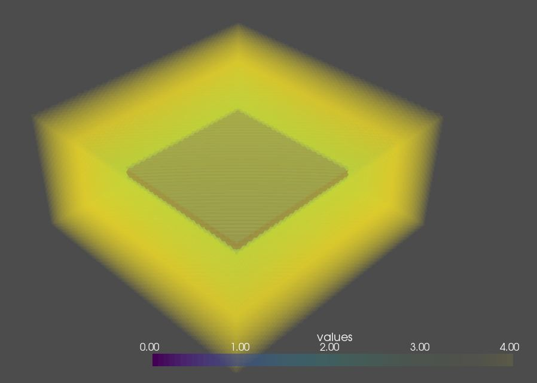
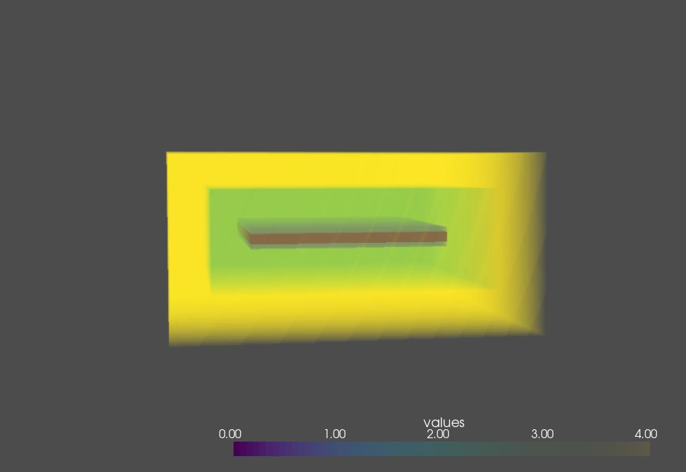

# Projet de simulation d'onde électromagnétique
L'objectif du projet et de simuler une onde électromagnétique dans une antenne patch pour la caractériser. 
Pour cela nous utiliserons la methode FDTD présenté dans la publication D. M. Sheen, S. M. Ali, M. D. Abouzahra, and J. A. Kong, Application of the three-dimensional finite-difference time-domain method to the analysis of planar microstrip circuits, IEEE Trans. Microwave Theory Tech., vol. MTT-43, Oct. 1995, pp. 2445-251. 
Et le livre Electromagnetic Simulation Using The FDTD Methode autheur DENNIS M. SULLIVAN. 

Le programme est en Python.

une vidéo résumant le projet est trouvable ici : https://youtu.be/cpaPIowOjSc

## Résultats actuels
Simulation de patch 2D fonctionnel en python et C pour une source ponctuelle. 
Résultats présentés sous forme d'animations / images

Les résultats présentés sont crée grace aux programme fait en Python

### Résultats avec une impusion sinusoïdal

### Résultats avec une impusion gaussienne

## Résultats du programme qui génére un patch en 3D

### Notice d'utilisation

Les programmes finis sont en python. Le projet MicroOnde n'est pas terminé, il est l'ébauche d'un programme pour simuler une onde électromagnétique dans un patch en 3D. 
Les programmes FDTD3D ne fonctionnes pas correctement. 
Les programme FDTD2D focntion avec un patch prédéfini rectangulaire de 60x60 cellule avec la source aux coordonnées 25;25. 
Il y a une version animation pour générer un fichier text où chaque images sont à la suites. 
Le fichier MenuTraitement.py permet de générer l'animation via des fonction à écrire en bas du script. 
Les versions non animation des fichier de simulation génére un fichier texte avec les valeurs du dernier pas de la simulation. 

